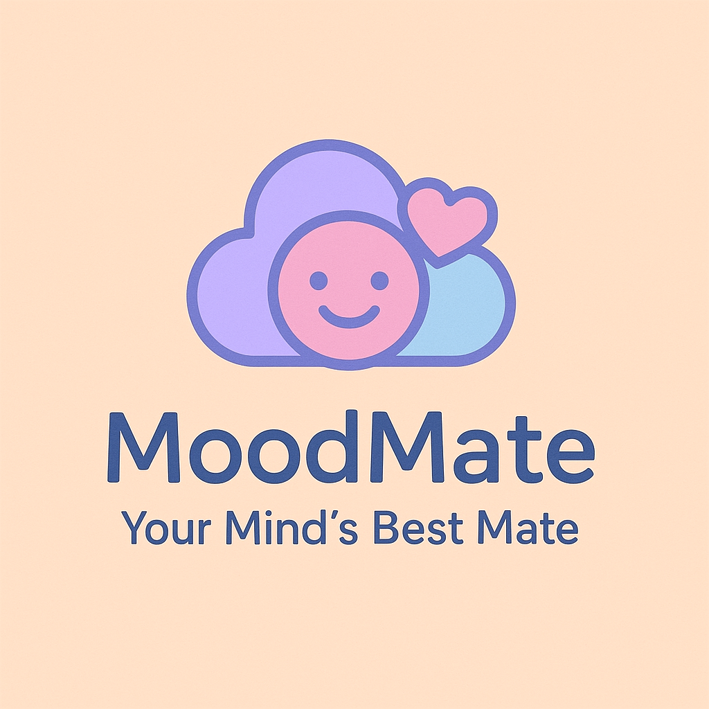
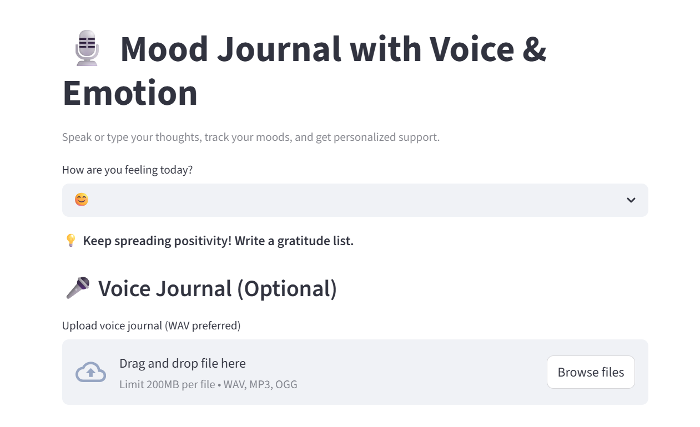
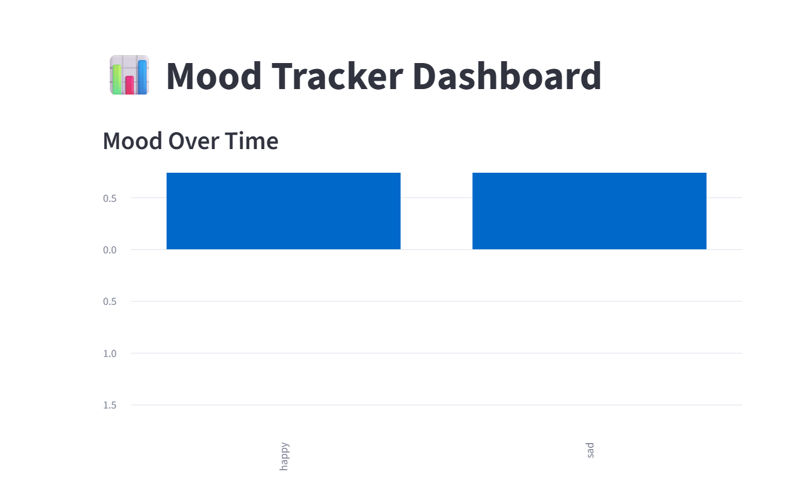

<p align="center">
  
</p>

<h1 align="center">🌈 MoodMate</h1>
<p align="center"><b>Your Smart Emotional Wellness Companion</b></p>


---

## 🧠 About

**MoodMate** is an AI-powered journaling and emotional health app built with **Streamlit**, designed to make mental wellness more interactive, personalized, and fun — especially for students and young professionals.

> ✨ Reflect. Feel. Heal. Repeat.

---

## 🌟 Features

- 🎤 **Voice-based Mood Journaling**
- 🧠 **Sentiment Detection using VADER**
- 📈 **Visual Dashboard for Mood Trends**
- 🧘‍♀️ **Meditation & Breathing Animations**
- 🗓️ **Google Calendar Reminder Sync**
- 🤖 **Empathetic AI Chatbot**
- 🏆 **Achievements & Streak Tracker**

---

## 🎯 Live Demo

🔗 **[Click here to try MoodMate →](https://moodmate-6xsbvbzxhzxheg9z87ou6v.streamlit.app/)**


---

## 🛠️ Tech Stack

| Layer       | Tools Used                                |
|-------------|--------------------------------------------|
| Frontend    | Streamlit + HTML + CSS                     |
| Backend     | Python                                     |
| AI/NLP      | NLTK (VADER Sentiment), SpeechRecognition  |
| Integrations| Google Calendar API (OAuth2)               |
| Storage     | JSON (local) or Firebase (future)          |

---

## 🚀 Quick Start

```bash
# Clone the repository
git clone https://github.com/saimeghana/moodmate.git
cd moodmate

# Setup environment
python -m venv venv
source venv/bin/activate  # (venv\Scripts\activate on Windows)

# Install dependencies
pip install -r requirements.txt

# Launch the app
streamlit run app.py
```

---

## 🔐 Google Calendar Setup (Optional)

To enable Google Calendar syncing:

1. Visit [Google Cloud Console](https://console.cloud.google.com)
2. Create a new project and enable **Google Calendar API**
3. Create **OAuth 2.0 Client ID** (Desktop App)
4. Download `credentials.json` → place it in your project root
5. First-time login will create `token.pickle` automatically

---

## 📸 Screenshots

| Voice Journal | Dashboard | Chatbot |
|---------------|-----------|---------|
|  |  |  |

---

## 🙋‍♀️ Meet the Developer

**K.N.V. Sai Meghana**

- 💼 [LinkedIn](https://www.linkedin.com/in/naga-venkata-sai-meghana-kovvada131b51259)
- 💻 [GitHub](https://github.com/SaiMeghana14)
- 🧠 Creator of MoodMate for academic + personal project use

---

## 📄 License

MIT License © 2025 | [View License](LICENSE)

---

## ⭐ Bonus Tip (for GitHub Pages)

If you're hosting this project site via **GitHub Pages**, create a separate `index.md` with this content for clean routing:

```markdown
---
layout: default
title: MoodMate
---


```

Make sure your `settings > Pages` source is set to the root `/docs` or `/main` branch if needed.

---

## 💖 If You Like This Project...

Give it a ⭐, share it with a friend, or use it as a template for your own AI wellness app!
